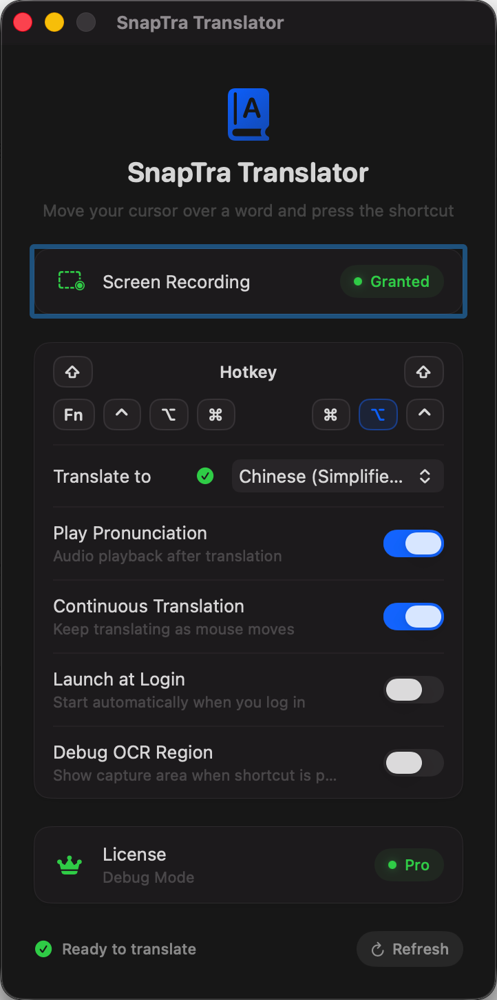
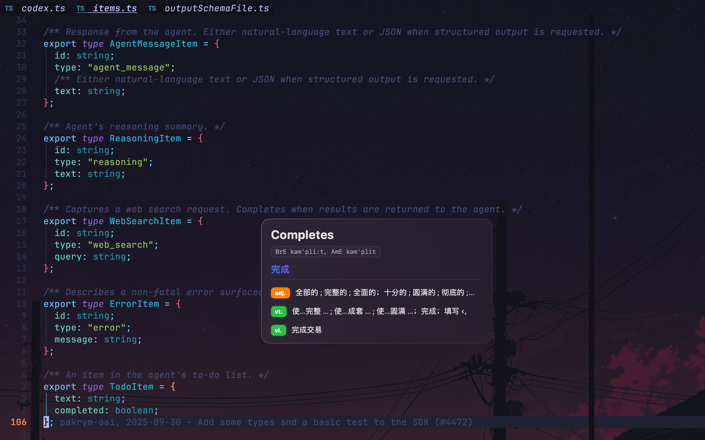

# SnapTra Translator

[English](README.md) | [简体中文](README.zh-CN.md) | [日本語](README.ja.md) | [한국어](README.ko.md)

A lightweight macOS menu bar app that instantly translates words under your cursor via screen capture and OCR. Press a hotkey, hover over any text, and get a beautiful floating bubble with translation, phonetics, dictionary definitions, and optional pronunciation.

## Preview

<p>
  
</p>

## Screenshots

<p>
  
  
</p>

## Features

### Core Translation
- **Instant OCR translation** - Captures screen region around cursor and detects the word closest to your pointer
- **Floating bubble overlay** - Modern translucent bubble appears near cursor with translation results
- **Dictionary definitions** - Shows detailed word definitions grouped by part of speech (noun, verb, adjective, etc.)
- **Phonetic notation** - Displays phonetic transcription for recognized words
- **Text-to-speech** - Optional pronunciation playback after translation

### Translation Modes
- **Continuous translation** - Keep translating as you move the mouse while holding the hotkey
- **Single lookup mode** - One translation per hotkey press with interactive bubble (copy, close buttons)

### Supported Languages
Chinese (Simplified), Chinese (Traditional), English, Japanese, Korean, French, German, Spanish, Italian, Portuguese, Russian, Arabic, Thai, Vietnamese

### Customization
- **Single-key hotkey** - Configure trigger key from modifier keys (Shift, Control, Option, Command, Fn)
- **Source/target language selection** - Choose your translation language pair
- **Launch at login** - Auto-start when you log in
- **Debug OCR region** - Visualize capture area and detected word bounding boxes for troubleshooting

### Additional Features
- **Copy to clipboard** - Quick copy word or translation
- **Language pack detection** - Automatically checks and prompts for missing language packs
- **Menu bar app** - Runs quietly in the menu bar without cluttering your dock

## Download

Available on the [Mac App Store](https://apps.apple.com/cn/app/snaptra-translator/id6757981764)

## Requirements

- macOS 14+ (translation features require macOS 15 for system Translation APIs)
- Screen Recording permission (required for OCR capture)

## Build & Run

Open in Xcode:
```bash
open "SnapTra Translator.xcodeproj"
```

Build from command line:
```bash
# Debug build
xcodebuild -project "SnapTra Translator.xcodeproj" -scheme "SnapTra Translator" -configuration Debug build

# Release build
xcodebuild -project "SnapTra Translator.xcodeproj" -scheme "SnapTra Translator" -configuration Release build

# Clean
xcodebuild -project "SnapTra Translator.xcodeproj" -scheme "SnapTra Translator" clean
```

## Repository Roadmap

The current shipping product remains the macOS app in the Xcode project. The repository now also reserves landing zones for future native platform work:

- `SnapTra Translator/Shared` for shared Swift contracts and pure logic
- `apps/windows` for a future native Windows shell
- `apps/linux` for a future native Linux shell
- `Native/core` for future extracted native logic only after it proves stable

These directories are documentation and architecture placeholders for now. No Windows or Linux build system is wired into the current macOS release target.

## Usage

1. **Grant permissions** - Launch the app and grant Screen Recording permission when prompted
2. **Configure settings** - Set your preferred hotkey and language pair in the settings window
3. **Translate** - Hold the hotkey and hover over any text; a bubble appears with translation, phonetics, and definitions
4. **Dismiss** - Release the hotkey to dismiss (or click X in single lookup mode)

## Troubleshooting

- **No bubble appears** - Check Screen Recording permission in System Settings > Privacy & Security > Screen Recording
- **Missing translations on macOS 15** - Install language packs in System Settings > General > Language & Region > Translation Languages
- **Hotkey not working** - Ensure no other app is using the same key; try a different modifier key
- **Bubble clipped at screen edge** - Enable "Debug OCR Region" to see the capture area and adjust cursor position

## License

MIT License
